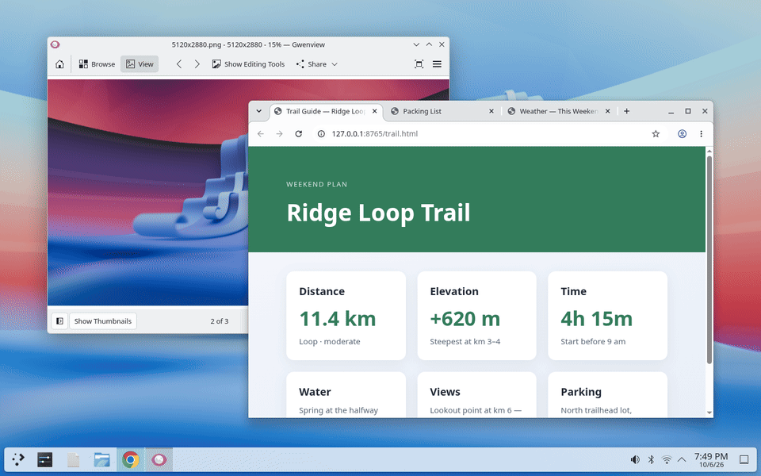
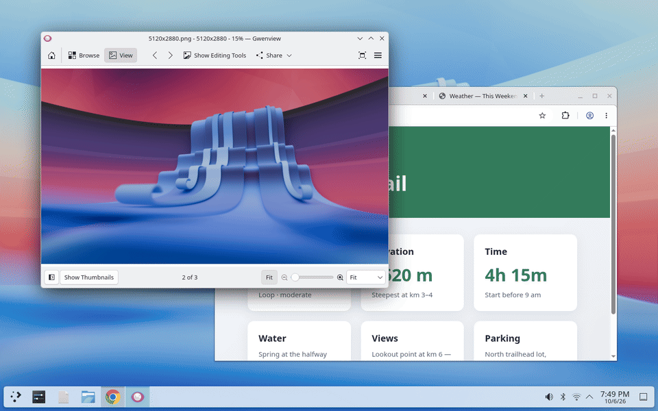
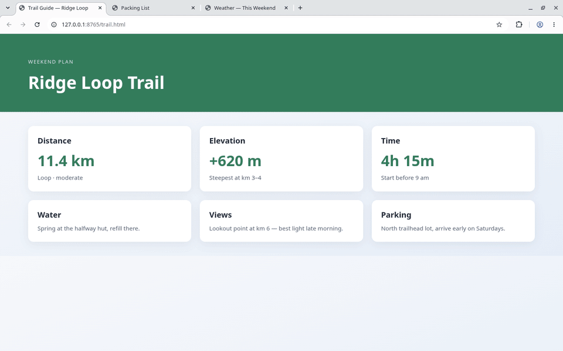
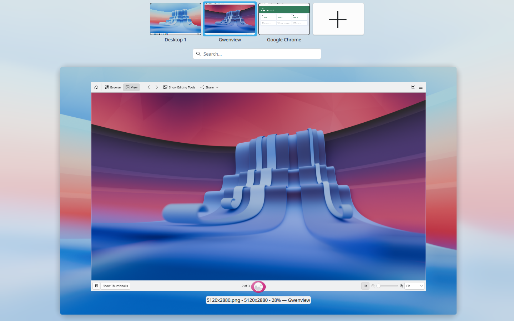
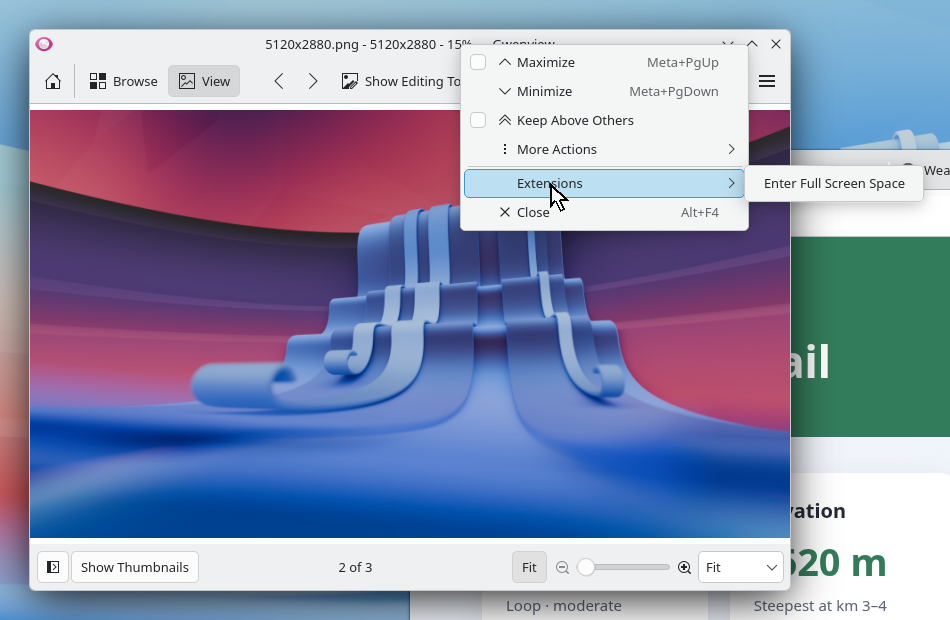

<h1 align="center">Fullscreen Spaces for KDE Plasma</h1>

<p align="center">
  <b>macOS-style full screen for KDE Plasma 6.</b><br>
  Every full screen app gets its own virtual desktop, a three-finger swipe away.<br>
  Hover at the top for the title bar. Close the app and its desktop goes away.
</p>

<p align="center">
  
  
  
  <a href="LICENSE"></a>
  <a href="https://github.com/VagueDustin/kwin-fullscreen-spaces/releases/latest"></a>
</p>

<p align="center">
  
</p>

## Why

On a Mac, full screen isn't just a bigger window. The app moves to its own Space next to your desktop, you swipe between them with three fingers, the menu bar slides in when you push the pointer to the top, and the Space disappears when you're done.

Plasma has every piece of that (virtual desktops, three-finger swipes, an Overview), but full screen just covers the screen where the window already is. **Fullscreen Spaces** is a small KWin script that wires those pieces together the macOS way.

## Features

- **Its own desktop.** Going full screen creates a desktop right next to the one the app came from, named after the app, and switches to it.
- **Apps keep their own UI.** <kbd>Meta</kbd>+<kbd>Ctrl</kbd>+<kbd>F</kbd> works like the green button on a Mac: the window fills the whole screen and covers the panel, but the app isn't told it's in full screen. Browsers keep their tabs and address bar. (<kbd>F11</kbd> is still there for apps' own full screen modes.)
- **Swipe between them.** Plasma's built-in three-finger swipe (or <kbd>Ctrl</kbd>+<kbd>Meta</kbd>+<kbd>←</kbd>/<kbd>→</kbd>) moves between your desktop and full screen apps.
- **Title bar on hover.** Push the pointer against the top edge and a title bar slides down with minimize, exit full screen and close.
- **Cleans up after itself.** Leave full screen, minimize or close the app, and its desktop is removed. You land back where you started.
- **New windows land on your desktop.** Launching an app while a full screen app is showing opens it on your normal desktop, like macOS.
- **Video and games too.** Real full screen (<kbd>F11</kbd>, video players, games) also gets its own desktop.

<table>
  <tr>
    <td width="50%"></td>
    <td width="50%"></td>
  </tr>
  <tr>
    <td align="center"><b>Title bar on hover</b></td>
    <td align="center"><b>Close the app, the desktop goes away</b></td>
  </tr>
  <tr>
    <td width="50%"></td>
    <td width="50%"></td>
  </tr>
  <tr>
    <td align="center"><b>Each app is a named desktop in the Overview</b></td>
    <td align="center"><b>Or use the window menu</b></td>
  </tr>
</table>

## Install

Requires **KDE Plasma 6**. Tested on Plasma 6.7 (Wayland).

**From the terminal**

```bash
git clone https://github.com/VagueDustin/kwin-fullscreen-spaces.git
cd kwin-fullscreen-spaces
./install.sh
```

It installs two small KWin scripts for your user only and turns them on right away. No root, no logout needed. Run it again later to update.

**From System Settings**

1. Download both `.kwinscript` files from the [latest release](https://github.com/VagueDustin/kwin-fullscreen-spaces/releases/latest).
2. Open **System Settings → Window Management → KWin Scripts → Install from File…** and pick each file.
3. Tick **Fullscreen Spaces** and **Fullscreen Spaces: Window Menu**, then click **Apply**.

## Use it

| Do this | What happens |
| --- | --- |
| <kbd>Meta</kbd>+<kbd>Ctrl</kbd>+<kbd>F</kbd> | Enter or leave macOS-style full screen |
| Right-click a title bar → **Extensions → Enter Full Screen Space** | Same thing, with the mouse |
| <kbd>F11</kbd> (in apps that support it) | The app's own full screen, also on its own desktop |
| Three-finger swipe left or right, or <kbd>Ctrl</kbd>+<kbd>Meta</kbd>+<kbd>←</kbd>/<kbd>→</kbd> | Move between your desktop and full screen apps |
| Push the pointer against the top edge | Show the title bar |
| <kbd>Meta</kbd>+<kbd>W</kbd> | Overview of every desktop |

To change the shortcut, go to **System Settings → Keyboard → Shortcuts → KWin → Fullscreen Spaces: Toggle macOS-style full screen**.

## Settings

**System Settings → Window Management → KWin Scripts**, then the settings button next to Fullscreen Spaces:

| Setting | Default |
| --- | --- |
| Open new windows on the normal desktop when launched from a full screen desktop | On |
| Show title bar when the pointer touches the top edge | On |
| Also show it in Steam games | Off |
| Ignored window classes (screenshot tools, Plasma itself, password prompts…) | A sensible list |

If an app or game misbehaves on its own desktop, add its window class to the ignored list. You can find the class with **right-click title bar → More Actions → Configure Special Window Settings…**.

## How it works

- **macOS-style full screen** maximizes the window, hides KDE's title bar (only for apps where KDE draws it), and keeps the window above others. While that desktop is showing, the panel on that screen is dropped below windows (what Plasma's own *Windows can cover* panel setting does) and is put back as soon as you switch away. Everything is restored when the window leaves.
- **Each full screen app gets a real Plasma virtual desktop.** The script tags the desktops it creates with an invisible character in their name, so it only ever removes its own. Leftovers are tidied up after a KWin restart.
- **The title bar** is a small KWin-drawn bar, so it works over any app, including ones in real full screen.

## Known limitations

- **Multiple monitors:** Plasma's virtual desktops span all screens, so switching to a full screen app switches every screen. This is like macOS with *Displays have separate Spaces* turned off.
- **The three-finger gesture** is Plasma's own, and Plasma doesn't let you change it yet.
- **Plasma's slide animation** draws the panel on top while it slides, so the panel flickers into view mid-swipe.
- **Window menu entries** from scripts appear under the **Extensions** submenu in Plasma 6.
- **X11** hasn't been tested.

## Similar projects

[MACsimize6](https://github.com/Ubiquitine/MACsimize6) moves full screen or maximized windows to their own desktop too, and also supports treating maximize that way. Fullscreen Spaces focuses on matching macOS full screen more closely: a mode where apps keep their UI, the hover title bar, desktops placed next to where the app came from, panel covering, and a window menu entry.

## Uninstall

```bash
./uninstall.sh
```

Or remove both scripts under **System Settings → Window Management → KWin Scripts**. Leave full screen in any apps first, otherwise their desktops stay behind (remove them from the Overview).

## Development

```
package/fullscreen-spaces/        main script (QML)
  contents/ui/main.qml            stub that loads Spaces.qml (see below)
  contents/ui/Spaces.qml          all the logic
  contents/ui/TitleBar.qml        the hover title bar
package/fullscreen-spaces-menu/   window menu entry (JavaScript, since QML scripts can't add one)
tools/demo/                       records the GIFs and screenshots in docs/media
```

- Edit, then run `./install.sh` to reload the scripts in your running session.
- KWin caches compiled QML for the whole session by file name, so `main.qml` loads `Spaces.qml` under a fresh URL each time. Without that, edits would only take effect after logging out. Changes to `main.qml` itself still need a logout.
- To watch the logs, run `journalctl --user -f | grep -i fullscreen-spaces`.
- `./build.sh` builds the `.kwinscript` files into `dist/`.
- `tools/demo/record.sh` re-records every image in `docs/media` inside a headless, isolated Plasma session (fresh settings, demo content only), driving it through KWin's D-Bus and a tiny fake-input client.

Issues and pull requests are welcome.

## License

[MIT](LICENSE) © Dustin Szabo
